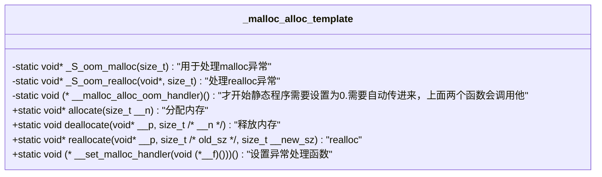
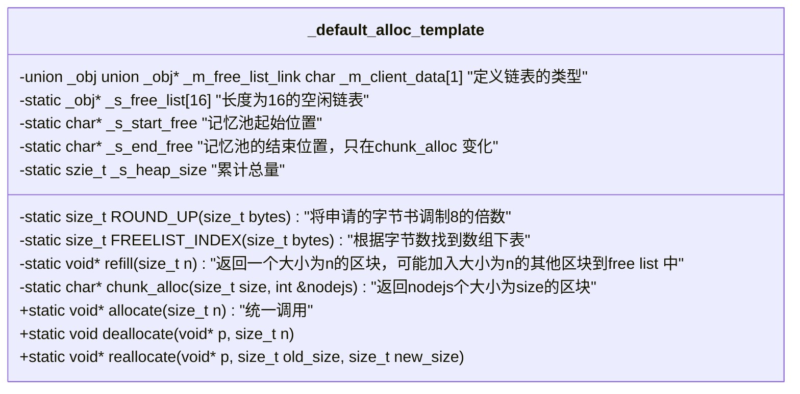
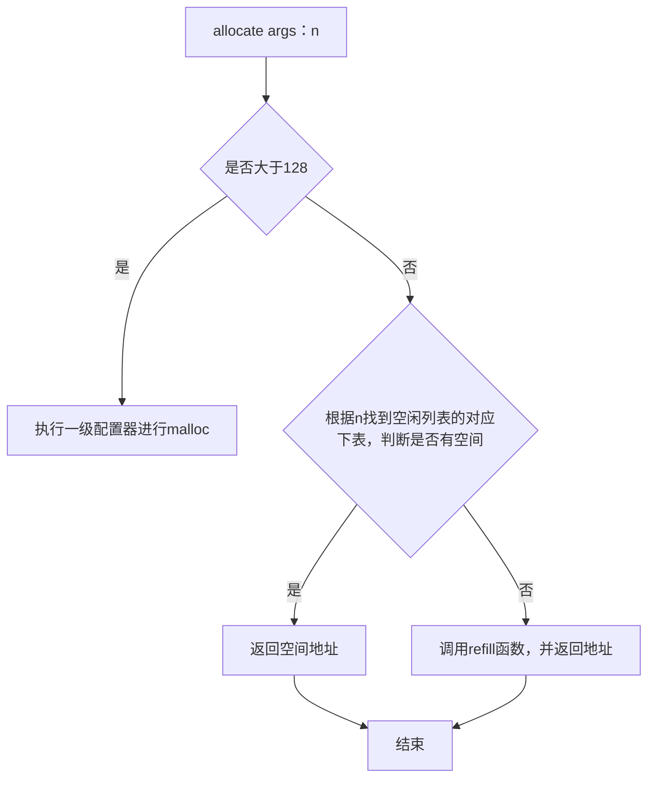

# chapter-1-alloc

## construct&destroy

### 全局的构造函数construct

1. construct包含两个版本：
   * 传递一个指针和一个值，直接对指针所指空间初始化
   * 只传递一个指针,只传递一个指针的话，就把指针所指向的空间置为空

2. construct内部调用_construct ,那_Construct也对应两个版本:
   * 接受一个指针和数值
   * 只接受一个指针

### 全局的析构函数

1. destroy包含两个版本
   * 只传递一个指针
   * 传递两个迭代器
2. destroy调用_Destroy,_Destroy 也对应的提供两个版本
   * 只传递一个指针，调用对应的析构函数。
   * 两个迭代器调用_destroy
3. _destroy 调用__destroy_aux 也有两个版本
   * __destroy_aux 析构没有析构函数的
   * __destroy_aux 析构有析构函数的，获得指针，直接再调用destroy只有一个指针的版本

## alloc (一级配置器和二级配置器)

### 一级配置器

直接用malloc和free来进行配置空间,里面这几个函数就可以处理



### 二级空间配置器

二级空间配置器，会有一个长度是16的数组，8-128字节，如果大于128字节会直接调用一级配置器。其他的会到链表中查找，找到合适的就把内存分配给他，申请的空间都调整到8的倍数。


类中静态成员变量要在类之后立马初始化

1. allocate 函数 
   
   申请空间

2. deallocate 函数

   释放空间
   ```mermaid
   graph TD
   A[deallocate args：p n] --> B{是否大于128}
    B -- 是 --> C[执行一级配置器进行deallocate]
    B -- 否 --> D[根据n找到空闲列表的对应下表,将空间放到空闲链表的第一个]
    C --> E[结束]
    D --> E
   ```
3. refill 函数
   
   重新填充free_list

   ``` mermaid
   graph TD
   A[refill args：n] --> B[通过chunk_alloc申请20*n的空间]
    B  --> C{判定返回值是1}
    C -- 是 --> D[直接返回chunk_alloc返回的地址]
    C -- 否 --> E[将第一块返回出去，剩下的加入到剩余列表中]
    D --> F[结束]
    E --> F
   ```
4. chunk_alloc
   
   从内存池中取空间给free list

   ```mermaid
   graph TD
   A[chunk_alloc args：size nodejs] --> B{判断需要的总空间size*nodejs和剩余空间end-start}
   B -- 余>总 --> C[返回start地址，并修改start]
   B -- 余>=size --> D[计算一共能返回多少个，把所有的都返回]
   B -- 余小于size --> E[将剩下的都分配进去，分配剩余空间到相应的链表]
   E --> F{malloc空间，判断是否失败}
   F --是--> G[巡视free list中比目标大的空间，拿出一个来，return递归的调用自己，<br>到这就直接返回了会。否则调用一级配置的allocate函数，里面有检查错误的，<br>直接抛出异常]
   F --否--> H[malloc分配内存后，递归调用自己]
   C --> L[结束]
   D --> L
   G --> L
   H --> L

### 内存基本处理工具


* template <class InputIterator, class ForwardIterator>
   ForwardIterator
   uninitialized_copy(InputIterator firstr, InputIterator last, ForwardIterator result);

   函数作用：将[first,last)之间的内容，拷贝到result开始的地方

   ```mermaid
   graph TD
   A[uninitialized_copy<br>args:first,last,result] --> B[_uninitialized_copy<br>args:first,last,result,value_type]
   B --> C{__uninitialized_copy_aux<br>args:first,last, result, _Is_POD<br>判断是否是POD}
   C --是--> D[直接copy]
   C --否--> E[以此执行构造函数]
   D --> F[结束]
   E --> F
   ```


* template <class ForwardIterator, class Size, class T>
   ForwardIterator
   uninitialized_fill_n(ForwardIterator first, size n, const T& x);

   函数作用：将从first开始的n个位置初始化为x，与上面相同，IS_POD 直接fill_n(也就是copy)，否则依次调用初始化函数construct。


* template <class ForwardIterator, class T>
   ForwardIterator
   uninitialized_fill(ForwardIterator first, ForwardIterator last, const T& x);

   函数作用：将[first,last)初始化为x，与上面相同，IS_POD 直接copy，否则依次调用初始化函数construct。


