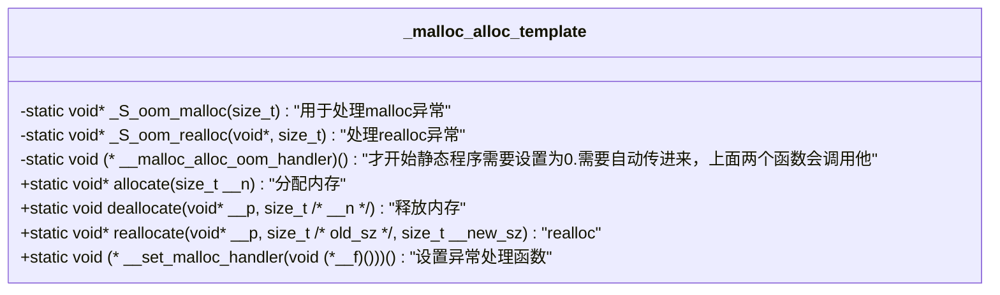

# chapter-1-alloc

## construct&destroy

### 全局的构造函数construct

1. construct包含两个版本：
   * 传递一个指针和一个值，直接对指针所指空间初始化
   * 只传递一个指针,只传递一个指针的话，就把指针所指向的空间置为空

2. construct内部调用_construct ,那_Construct也对应两个版本:
   * 接受一个指针和数值
   * 只接受一个指针

### 全局的析构函数

1. destroy包含两个版本
   * 只传递一个指针
   * 传递两个迭代器
2. destroy调用_Destroy,_Destroy 也对应的提供两个版本
   * 只传递一个指针，调用对应的析构函数。
   * 两个迭代器调用_destroy
3. _destroy 调用__destroy_aux 也有两个版本
   * __destroy_aux 析构没有析构函数的
   * __destroy_aux 析构有析构函数的，获得指针，直接再调用destroy只有一个指针的版本

## alloc (一级配置器和二级配置器)

### 一级配置器

直接用malloc和free来进行配置空间,里面这几个函数就可以处理

### 二级空间配置器

二级空间配置器，会有一个长度是16的数组，8-128字节，如果大于128字节会直接调用一级配置器。其他的会到链表中查找，找到合适的就把内存分配给他，申请的空间都调整到8的倍数。

